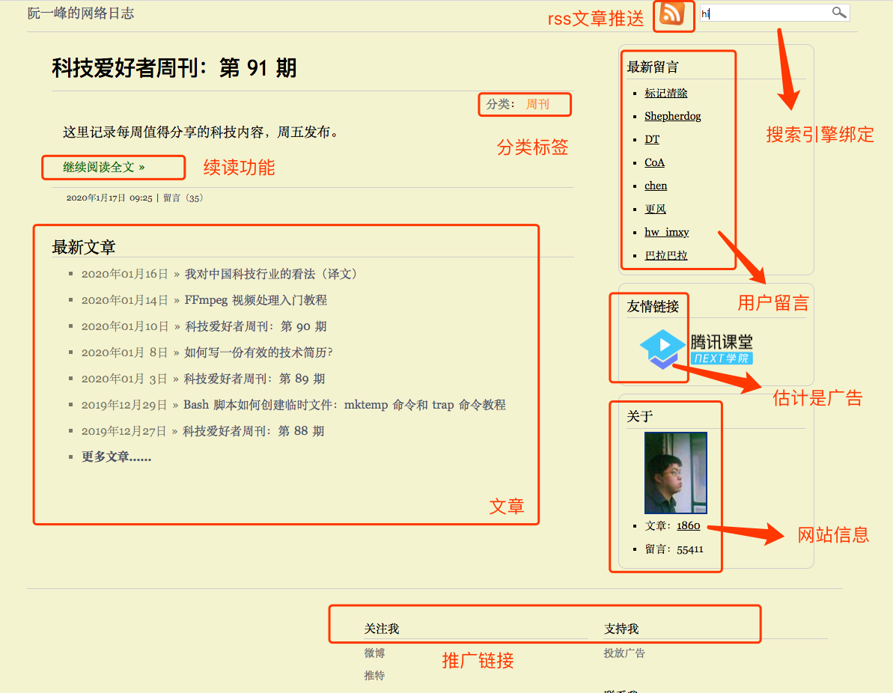
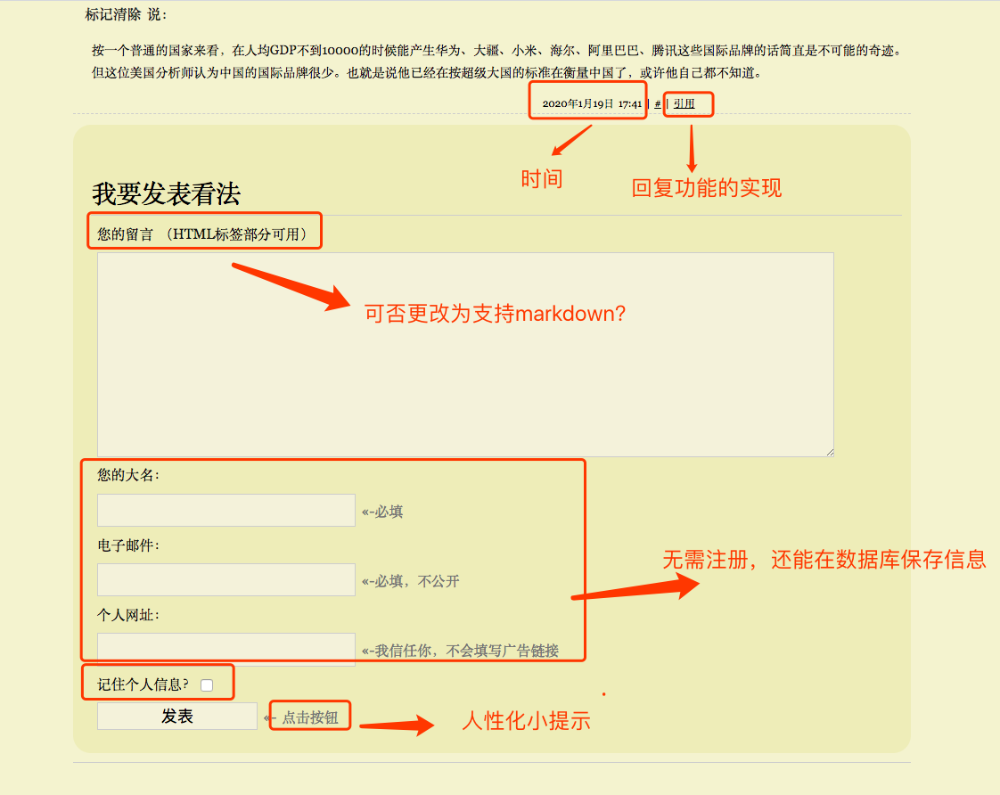
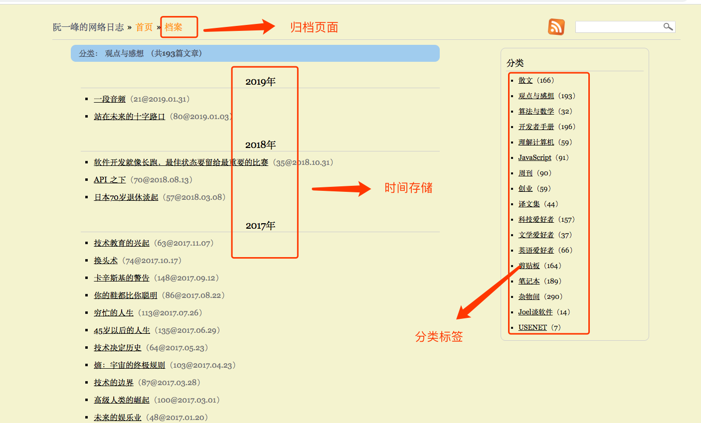
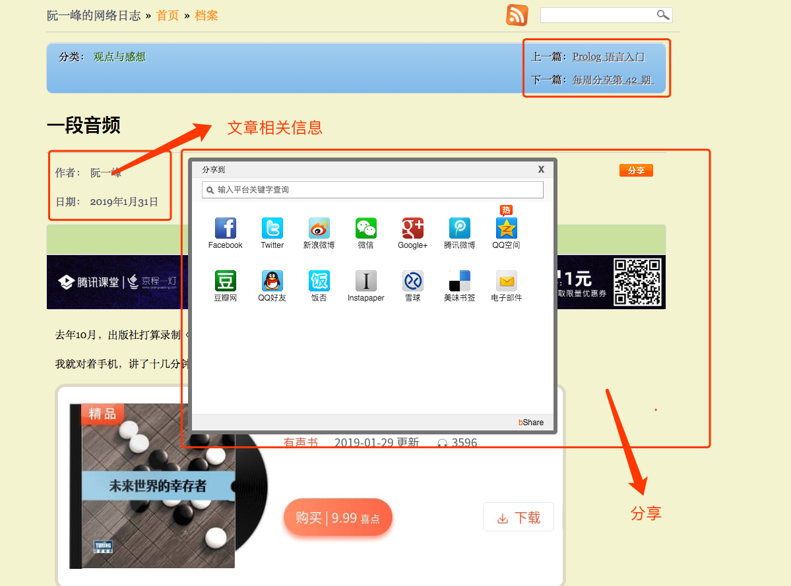
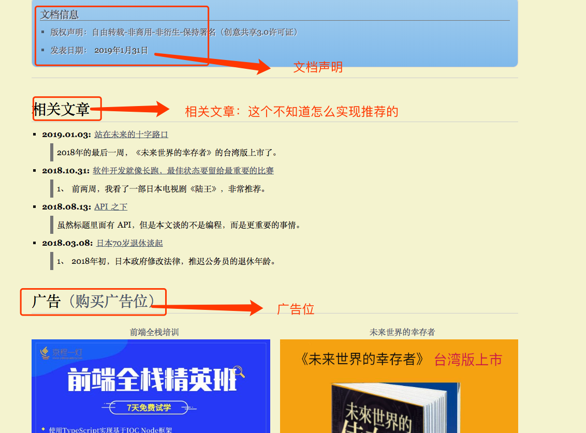

# 博客相关项目功能调研
> 本次调研主要针对不同功能的博客进行调研，目的是调研得出，其他人博客的主要功能封装，为下一步后端的主要功能设计提出指导及解决方案。

### 调研结构
- 博客名称
- 博客基础功能
- 创新点

## 有大量广告投放的博客 
### 1.阮一峰的网络日志

基础界面：

基础功能：
1. 文章发布
    * 文章可采用Deed或者邮箱订阅的形式值得学习借鉴到自己的博客中，增加此项功能方便使用。
    * 基本功能较为完备，每一篇文章都具有，**时间**、**标签**、**作者**、**文档信息**、**相关推荐**、**留言**。相对较为完备。
2. 评论留言
   * 评论留言区不用注册，还能保留信息，方便联系操作，每条回复在数据库上保存**留言**、**时间**、**作者姓名**、**电子邮箱**、**个人网址**，发表信息请求方式有待研究但整体相对比较完备。
3. 博客整体感想
   * 此博客实现相对页面简单，比较朴实厚重，可以参考其实现功能，作为第一版博客，前端的优化及美工工作可以等第二版博客完成后添加，是功能学习的首选。

